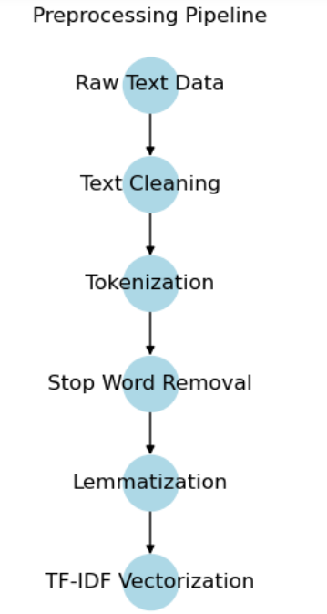
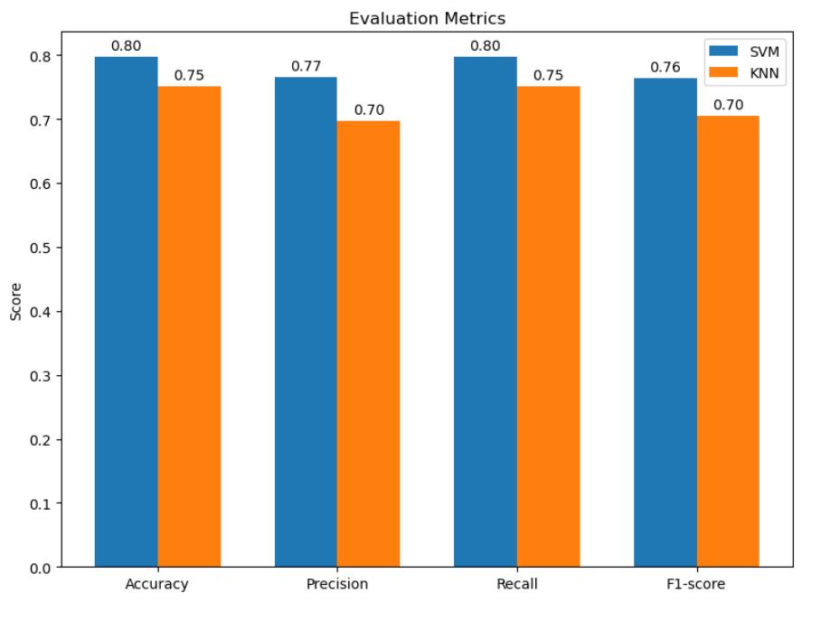

# Sentiment Analysis of Android App Reviews

## 1.0 Project Overview

Sentiment analysis has emerged as a powerful tool for understanding user opinions and emotions expressed in textual data, particularly in the context of mobile application reviews. With the exponential growth of the Android application market, competition among Android Application Development (AAD) companies has intensified. This project aims to leverage sentiment analysis techniques to evaluate user satisfaction and identify the most successful AAD company based on customer feedback.

## 2.0 Problem Statement

The main aim of this project is to develop an advanced data analysis (Machine learning) that employs sentiment analysis techniques to automatically analyze the provided dataset of Amazon reviews. The algorithm will identify the sentiment (positive, neutral, or negative) expressed in each review and use this information to determine the most successful AAD company based on customer feedback.

## 3.0 Objectives

The primary objectives of this project are:
1.  To develop a sentiment analysis system using SVM and KNN algorithms to evaluate user reviews of Android applications developed by three AAD companies. 
2.  To assess the performance of SVM and KNN models in sentiment classification and identify the best-performing model.
3.  To determine the most successful AAD company based on user sentiment analysis results.

## 4.0 Dataset
The dataset used in this project consists of 40,000 user reviews of Android applications developed by three AAD companies. The dataset is divided into two parts:

1.  Training dataset [Download Here](reviews_Apps_for_Android_5.training.txt): Contains 20,000 reviews that will be used for developing and training the sentiment analysis algorithms. 
2.  Test dataset [Download Here](reviews_Apps_for_Android_5.training.txt): Contains 20,000 reviews that will be used for evaluating the performance of the sentiment analysis algorithms. There is no overlap between the reviews in the training and test datasets. 

Each review in both the training and test datasets consists of the following components:

- Review text: The actual text content of the review provided by an Amazon customer.
- Sentiment label: A class label indicating the sentiment of the review, with possible values of 1 (negative review), 2 (neutral review), and 3 (positive review).
- Android application ID code: The unique identifier of the Android application associated with the review.

The dataset covers reviews from a total of nine Android applications, with each of the three AAD companies owning three applications. The table below shows the Android application ID codes for the applications belonging to each AAD company:

Company Name | Android Application Codes
:-----------:|:------------:
AAD_1|B004NWLM8K, B004Q1NH4U, B004LPBTAA
AAD_2|B004S6NAOU, B004R6HTWU, B004N8KDNY
AAD_3|B004KA0RBS, B004NPELDA, B004L26XXQ

## 5.0  Methodology

The sentiment analysis system is developed using SVM and KNN algorithms. The project follows these key steps:

#### 5.1 Importing neccessary libraries: 
The Python libraries used in this project are detailed in the ```requirements.txt```. file and are also displayed in the submitted *_Jupyter notebooks code_* 

#### 5.2  Defining Function to Load the Training and Test Dataset:
The defined function, as displayed in the code snippet, assists in loading both the training and test datasets in Jupyter Notebook.

```
def load_dataset_from_txt(input_txt_file):
    reviews = []
    labels = []
    app_ids = []
    with open(input_txt_file, 'r') as file:
        lines = file.readlines()
        for line in lines:
            fields = line.strip().split('\t')
            labels.append(int(fields[0]))
            app_ids.append(fields[1])
            reviews.append(fields[2])
    return reviews, labels, app_ids
```

#### 5.3     Data Preprocessing: 
To prepare the dataset for sentiment analysis, a series of preprocessing steps are applied to both the training and testing datasets.

Text Cleaning: 
-	Remove HTML tags, special characters, and URLs if exist
-	Convert text to lowercase.
-	Remove digits and punctuation.

Tokenisation:
-	Split the cleaned text into individual words or tokens.
Stop Words:
-	Remove common stop words (e.g., "a," "an," "the") that do not contribute significantly to sentiment.

Lemmatization:
-	Reduce words to their base or dictionary forms to handle inflectional variations.

TF-IDF Vectorization:
-	Transform the preprocessed reviews into numerical feature vectors using the Term TF-IDF scheme.
-	Weight words according to their frequency within a review and their rarity in the entire dataset.

A function named ```preprocess_dataset``` is defined to implement all the preprocessing pipelines explained above. Whenever the function is called on any dataset, it will clean and refine the dataset. This function is used on both the training and test datasets.
```
# Function for data preprocessing
def preprocess_dataset(dataset):
    preprocessed_dataset = []
    for review in dataset:
        review = review.lower()
        review = re.sub(r'http\S+|www\S+', '', review)
        review = review.translate(str.maketrans('', '', string.punctuation))
        review = re.sub(r'\d+', '', review)
        tokens = review.split()
        stop_words = set(stopwords.words('english'))
        tokens = [token for token in tokens if token not in stop_words]
        lemmatizer = WordNetLemmatizer()
        tokens = [lemmatizer.lemmatize(token) for token in tokens]
        preprocessed_review = ' '.join(tokens)
        preprocessed_dataset.append(preprocessed_review)
    return preprocessed_dataset
```
Here are all the implemented Preprocessing Pipelines in this project:




#### 5.4  Model Training and Evaluation:
The SVM and KNN models are trained using the preprocessed dataset, and their performance is evaluated using metrics such as accuracy, precision, recall, and F1-score.


---
#### 5.5  Sentiment Analysis of AAD Companies: 
Utilizing the superior best-performing model, in this case, the SVM model, user reviews of Android applications developed by three AAD companies are analyzed. Sentiment scores for each company are derived from the proportion of positive, negative, and neutral customer reviews as displayed below.

Company | Positive Percentage | Negative Percentage | Neutral Percentage
|:-----------:|:------------:|:------------:|:---------:|
AAD_1|98.13%|1.87%|0.00%
AAD_2|74.31%|22.94%|2.75%
AAD_3|65.48%|32.74%|1.79%
---

#### 5.6 Identification of the most successful AAD Commpany: 
-   A weighted sentiment score is calculated to identify the most successful AAD company.
-   Different weights are assigned to each polarity (positive, negative, and neutral) to obtain an overall sentiment measure for each company.  
-   The company with the highest weighted sentiment score is considered the most successful.

See result below as it showcases the plot of the best AAD Companies:


##  6.  Results:

The SVM model outperformed the KNN model in terms of accuracy, precision, recall, and F1-score, making it the best-performing model for sentiment analysis in this study. The SVM model was then applied to analyze the reviews of Android applications developed by the three AAD companies. AAD_1 emerged as the most successful company, achieving a weighted sentiment score of 96.26, indicating a strong positive sentiment towards its applications.


However, in gaining in-dept insight towards the success of AAD companies, as displayed above AAD_1, the word cloud highlights positive terms such as “love", "great", "fun", “one", "good", "play", and "love", indicating a generally positive sentiment towards their apps. Users seem to enjoy the interactive and entertaining aspects of AAD_1's applications.

In contrast, the word cloud for AAD_2 includes terms like "good", "play", "game", “Scrabble”, “Zombie”, "time", "fun", and "free", suggesting that users appreciate the gaming experience and the free nature of AAD_2's apps. However, the presence of the word "even" may hint at some mixed sentiments or comparisons being made.

For AAD_3, the word cloud features terms like "game", "free", "one”, and "play", indicating that gaming and free apps are important factors for users. However, the inclusion of words like "work", "people", and "use" suggests that AAD_3's apps may have a more practical or utilitarian aspect compared to the other companies.


## 7. Conclusion
This project demonstrates the practical utility of sentiment analysis in assessing company performance and market position in the Android application development industry. The findings highlight the effectiveness of traditional machine learning algorithms like SVM in sentiment classification when labeled data is limited. The project contributes to the literature on sentiment analysis and its applications in the mobile app industry, providing valuable insights for AAD companies to improve user satisfaction and stay competitive in the market.

## Repository Structure
- ```Dataset/```: Contains the training and test datasets used in the project.
-   ```src/```: Contains the source code for data preprocessing, model training, and evaluation. Providing step-by-step explanations of the sentiment analysis process 
-   ```Result```: Contains the evaluation results and visualizations.
-   ```requirements.txt```: Lists the required Python dependencies for running the project.
-   ```README.md```: Provides an overview of the project and instructions for running the code.

## Getting Started
1. Clone the Repository:
2. Install the required dependencies:
```
pip install -r requirements.txt
```
3. Run the sentiment analysis pipeline:
```
python src/main.py
```
4. Explore the results and visualizations in the ``results/`` directory

## Contributing
Contributions to this project are welcome. If you find any issues or have suggestions for improvement, please open an issue or submit a pull request.

## License
This project is licensed under the MIT License.
We would like to thank the Android Application Development companies for providing the dataset used in this project. 

## Acknowledgement
We also acknowledge the contributions of the open-source community in developing the libraries and tools used in this project.

## Contact
For any questions or inquiries, please contact ayanrinnopeter@mail.com

---


